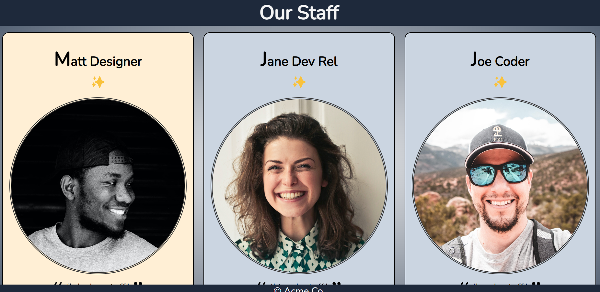

# cssPractice

this project shows how to style our page
through different styling element 

like pseudo css
responsive page at different point
position styles like stick relative

and more ....

# page look like

# bisrat

